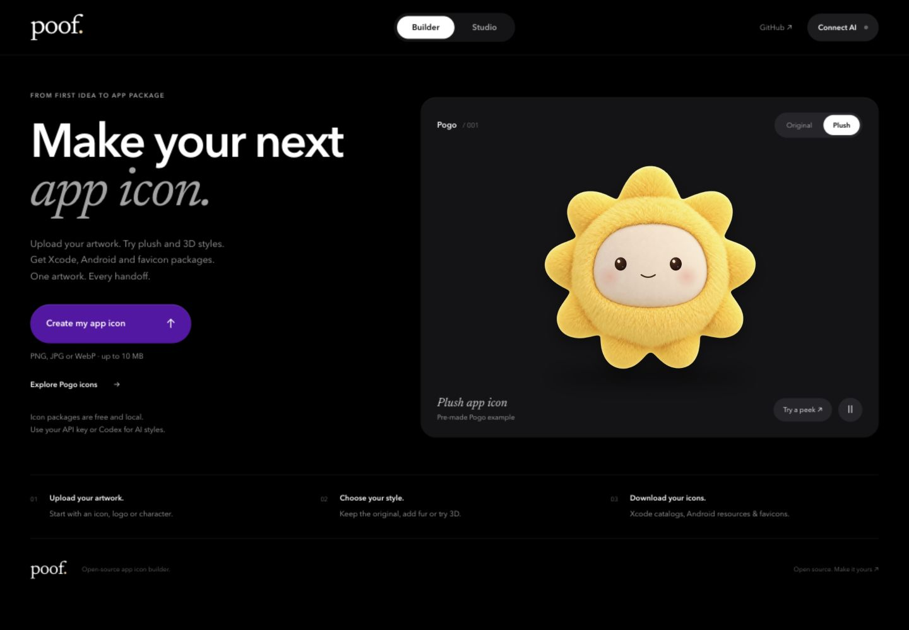

# poof ✳

**Turn your artwork into app icons for Apple, Android and the web.**

Upload an icon, logo or character. Adjust its framing, color and background, or use AI to explore plush and clay styles. Export asset catalogs, Android resources and favicons in one package.



## Run locally

Requires **Node.js 22 or later**. No dependency installation or build step.

```sh
git clone https://github.com/sanjaikuttyy/poof.git
cd poof
npm start
```

Open [localhost:8770](http://127.0.0.1:8770) and keep the terminal running. Choose **Explore Pogo icons** to try the bundled example without a key or an AI request.

## Choose your workflow

| What you want | How to do it | What you need |
| --- | --- | --- |
| Package existing artwork | Upload → **Customize this image** → **Get app package** | No account or API key |
| Create a plush or clay style | Upload → choose material → generate → customize | Your OpenAI API key, billing and model access |
| Generate in Codex | Upload → **Use my Codex instead** → **Open in Codex** | Installed desktop app and CLI on macOS, plus an available image tool |
| Use Codex on another setup | Prepare and unzip the kit → open its folder in Codex → use `PROMPT.md` | Codex with an available image tool |

The Codex kit includes a project-scoped `$poof-icon` skill. Opening it prepares the workspace; you paste and send the request to begin generation. Import `result.png` back into Poof when it is ready.

**Customize** puts center, left peek, right peek and bottom peek above the preview. The side panel controls size, background, gradient, seasonal accents and motion. These edits happen locally. Native app icons are static; motion is available in SVG previews and exports.

## What you get

| Target | Package contents |
| --- | --- |
| iOS / iPadOS | `AppIcon.appiconset`, 18 classic catalog slots, `Contents.json`, opaque 1024px master |
| macOS | Separate asset catalog with ten 1×/2× slots |
| Android | Five densities of legacy, round, adaptive and monochrome icons; API 26/33 XML; manifest snippet; Play listing image |
| Web | Multi-size favicon ICO, PNG favicons, Apple touch icon, ordinary and maskable PWA icons, manifest and HTML tags |
| Handoff | Source artwork, JSON recipe, export report and installation instructions |

All targets together produce 72 files; custom monochrome artwork adds one source file. You can export only the platforms you need. See the [platform guide](docs/PLATFORM-GUIDE.md) for installation details, framing rules and sources.

Poof exports static raster Apple catalogs. It does not create Icon Composer documents, Apple dark/tinted variants, watchOS, tvOS or visionOS assets. Adaptive and maskable icons use a separate safe frame. Review the generated previews, especially the 16px favicon and Android monochrome mark, before integrating them into an app.

## Your data

Artwork and the API key remain in tab memory until you generate, download or explicitly open a Codex kit. AI generation sends the source and art direction to OpenAI through the local server. Opening a Codex kit saves its files under the ignored `exports/codex/` directory. No analytics or shared API key is included.

This is a local development tool, not a multi-user hosted service. Read the [data handling and security boundaries](SECURITY.md).

## Documentation

- [Usage and troubleshooting](docs/USAGE.md): uploads, styles, peeks, downloads and common errors.
- [Architecture](docs/ARCHITECTURE.md): repository map, responsibilities and request flows.
- [Testing](docs/TESTING.md): automated checks, browser checks and package verification.
- [Contributing](CONTRIBUTING.md): development workflow and where to make changes.

```sh
npm run check                              # Code, links, generated files and tests
npm run verify -- /path/to/app-icons.zip    # Inspect a downloaded package
npm run verify:apple -- /path/to/app-icons.zip # Compile catalogs with Xcode on macOS
```

## License

Code is [MIT](LICENSE). The material recipe adapts agentara’s MIT-licensed [fluffy-poofy-3d-characters](https://github.com/agentara/skills/tree/main/skills/aigc/fluffy-poofy-3d-characters); see [third-party notices](THIRD_PARTY_NOTICES.md). The Pogo name and demonstration artwork have [separate terms](public/assets/NOTICE.txt). Your artwork remains yours; provider terms apply to AI outputs.
